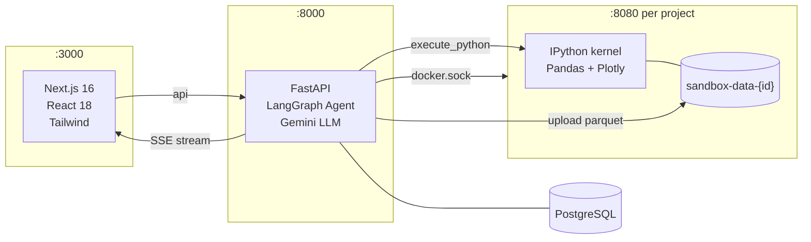
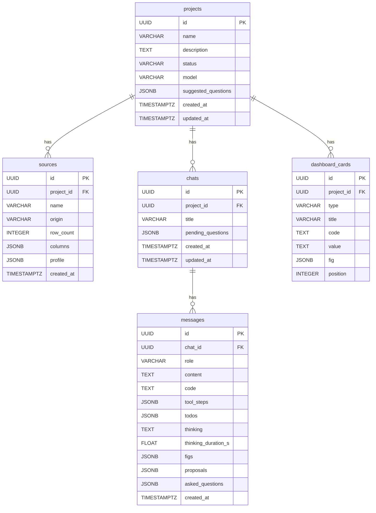

# data.agent

WIP - AI data analysis agent.


```mermaid
graph LR
    subgraph Frontend[":3000"]
        Next["Next.js 16<br/>React 18<br/>Tailwind"]
    end

    subgraph Backend[":8000"]
        API["FastAPI<br/>LangGraph Agent<br/>Gemini LLM"]
    end

    subgraph Sandbox[":8080 per project"]
        Kernel["IPython kernel<br/>Pandas + Plotly"]
        Vol[("sandbox-data-{id}")]
        Kernel --- Vol
    end

    DB[(PostgreSQL)]

    Next -->|"api"| API
    API -->|"SSE stream"| Next
    API --- DB
    API -->|"upload parquet"| Vol
    API -->|"execute_python"| Kernel
    API -->|"docker.sock"| Sandbox
```

## Database Schema


```mermaid
erDiagram
    projects ||--o{ sources : "has"
    projects ||--o{ chats : "has"
    projects ||--o{ dashboard_cards : "has"
    chats ||--o{ messages : "has"

    projects {
        UUID id PK
        VARCHAR name
        TEXT description
        VARCHAR status
        VARCHAR model
        JSONB suggested_questions
        TIMESTAMPTZ created_at
        TIMESTAMPTZ updated_at
    }

    sources {
        UUID id PK
        UUID project_id FK
        VARCHAR name
        VARCHAR origin
        INTEGER row_count
        JSONB columns
        JSONB profile
        TIMESTAMPTZ created_at
    }

    chats {
        UUID id PK
        UUID project_id FK
        VARCHAR title
        JSONB pending_questions
        TIMESTAMPTZ created_at
        TIMESTAMPTZ updated_at
    }

    messages {
        UUID id PK
        UUID chat_id FK
        VARCHAR role
        TEXT content
        TEXT code
        JSONB tool_steps
        JSONB todos
        TEXT thinking
        FLOAT thinking_duration_s
        JSONB figs
        JSONB proposals
        JSONB asked_questions
        TIMESTAMPTZ created_at
    }

    dashboard_cards {
        UUID id PK
        UUID project_id FK
        VARCHAR type
        VARCHAR title
        TEXT code
        TEXT value
        JSONB fig
        INTEGER position
    }
```

## Setup

```bash
cp .env.example .env   # add your GOOGLE_API_KEY
docker compose up --build
```

Open http://localhost:3000.
