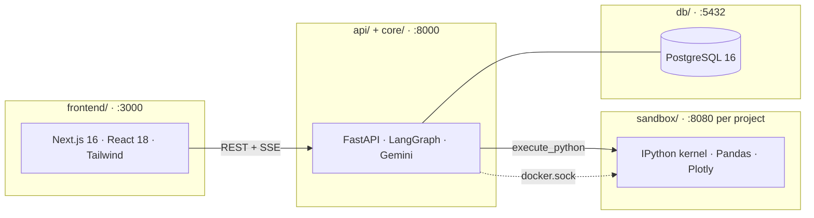
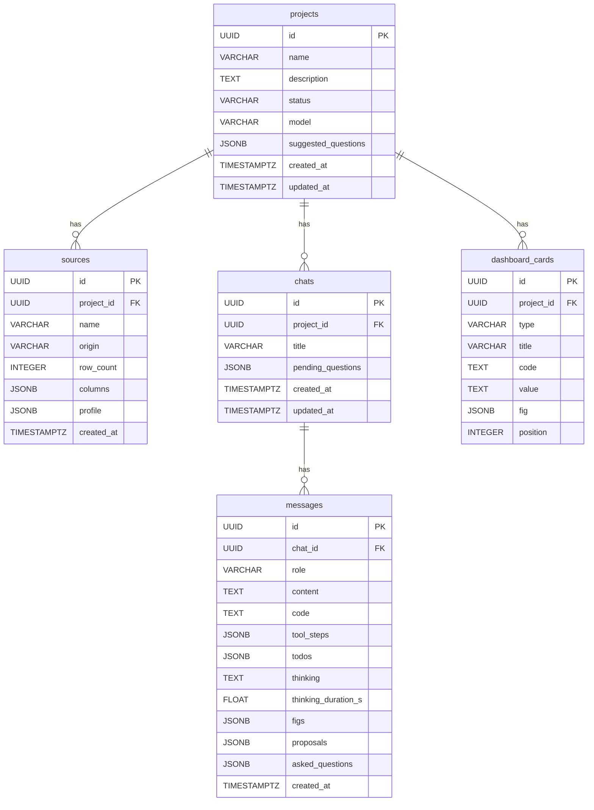

# data.agent

WIP - Agentic analytics assistant

## Setup

```bash
cp .env.example .env   # add your GOOGLE_API_KEY
docker compose up --build
```

Rebuild sandbox after pulling: `docker compose build sandbox-image`
Open http://localhost:3000.

## Overview 

<p align="center">
  
</p>

## Architecture



## CDM



